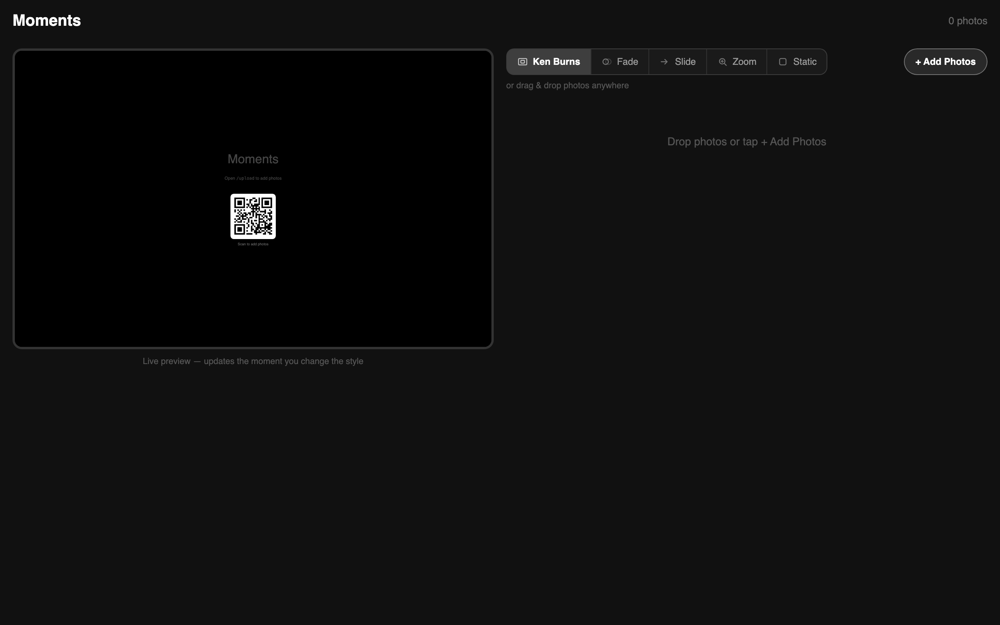
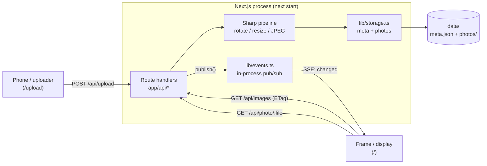
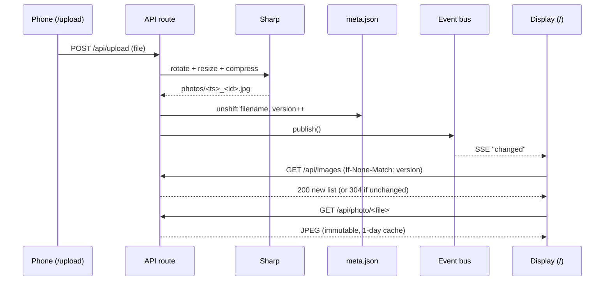

# Moments

A self-hosted digital photo frame. Upload photos from your phone, and any screen on your network shows a synced, fullscreen slideshow - with Ken Burns, fades, a blurred backdrop for portraits, and live updates the moment a new photo arrives.



[](LICENSE)


## Contents

- [Features](#features)
- [Architecture](#architecture)
- [How a photo travels](#how-a-photo-travels)
- [Design decisions and trade-offs](#design-decisions-and-trade-offs)
- [Tech stack](#tech-stack)
- [Quick start](#quick-start)
- [Configuration](#configuration)
- [Deploy (Raspberry Pi kiosk)](#deploy-raspberry-pi-kiosk)
- [Testing](#testing)
- [Project layout](#project-layout)
- [License](#license)

## Features

- Upload from any device - drag and drop, multi-select, or scan the on-screen LAN QR code to add photos from your phone.
- Five slideshow styles - Ken Burns, Fade, Slide, Zoom, and Static - chosen from a live segmented control.
- Blurred backdrop fill so portrait photos fit by height with no black bars.
- Live preview side by side with the controls; change a style and see it instantly.
- Real-time sync across devices over Server-Sent Events - upload on your phone and the frame updates within a second.
- Wall-clock synced slideshow so every screen shows the same photo at the same moment.
- Rotate and delete photos with a tap (long-press on touch).
- Server-side image processing with Sharp: EXIF auto-rotate, resize, and JPEG compression.

## Architecture

Moments is a single Next.js process. Route handlers are the only HTTP surface, two small `lib` modules hold all the logic (filesystem storage + an in-process change bus), and state lives in one `meta.json` manifest plus a folder of JPEGs. No database, no external services.



Three layers, one direction of flow:

| Layer | Files | Role |
|-------|-------|------|
| Routes | `app/api/*` | HTTP surface: `upload`, `images`, `photo`, `rotate`, `delete`, `style`, `events` (SSE), `lan` (QR) |
| Core | `lib/storage.ts`, `lib/events.ts` | Filesystem-backed manifest + photos; in-process change bus |
| Client | `app/page.tsx`, `app/upload/page.tsx` | The frame (display) and the phone upload UI |
| State | `data/meta.json` + `data/photos/` | Single JSON manifest (order, style, pin, version) + JPEG files |

A single monotonic `version` integer in `meta.json` is the backbone: it is bumped on every change, broadcast as an SSE "changed" ping, and returned as the `ETag` on `/api/images` so clients `304` when nothing moved.

## How a photo travels



Every screen computes which photo to show from wall-clock time, so displays that never talk to each other still land on the same image at the same second.

## Design decisions and trade-offs

Moments optimizes for one thing: a photo frame that any non-technical person can run on a Raspberry Pi at home. Every choice below follows from that.

| Decision | Chosen | Alternative | Why this trade-off | Cost we accept |
|----------|--------|-------------|--------------------|----------------|
| Storage | Filesystem + one `meta.json` | SQLite / Postgres | Zero setup, trivially backed up (copy a folder), readable by hand | Read-modify-write on `meta.json` is not atomic; concurrent writers can race |
| Realtime | Server-Sent Events | WebSockets | One-way server->client is all a frame needs; SSE is plain HTTP, no upgrade, auto-reconnects | Server push only; clients cannot stream back |
| Change fan-out | In-process pub/sub | Redis / external broker | No infra to run; a Pi has one process anyway | Single process only - cannot scale horizontally or run serverless |
| Slideshow sync | Wall-clock index | Elect a leader / coordinator | Stateless: every screen derives the same index from the clock, no coordination messages | Screens must share a roughly correct clock |
| Cache invalidation | Monotonic `version` + ETag | Timestamps / cache-busting query | One integer drives both SSE and HTTP `304`; no clock skew, no guessing | Version must be bumped on every mutation |
| Images | Sharp, re-encode to JPEG | Store originals as-is | Native C++ speed; EXIF auto-rotate, bounded dimensions, progressive JPEG | Originals are not preserved; everything becomes JPEG |
| Auth | None (LAN trust) | Login / tokens | A home frame on a trusted LAN should just work when you scan the QR | Anyone who can reach the port can upload or delete - do not expose it to the internet |
| Deploy target | Self-host / Pi kiosk | Vercel / serverless | The app is stateful and needs one long-lived process for the filesystem and SSE | Not deployable to ephemeral serverless (state and SSE would break) |

> Security note: Moments has no authentication by design - it assumes a trusted home LAN. Do not bind it to a public interface or forward the port to the internet.

## Tech stack

- Next.js 16 (App Router) and React 19, TypeScript strict
- Sharp for image processing, qrcode for the LAN QR
- Filesystem-backed storage (no database)
- Tests: Vitest + React Testing Library + MSW (unit/component), Playwright (E2E), v8 coverage

## Quick start

```bash
git clone https://github.com/bunlongheng/moments.git
cd moments
npm install
npm run dev
```

- Display (the frame): http://localhost:3000
- Upload UI: http://localhost:3000/upload

Open the display on the screen you want as the frame, then add photos from `/upload` (or scan the QR shown on the frame).

## Configuration

| Env var | Default | Purpose |
|---------|---------|---------|
| `MOMENTS_DATA_DIR` | `./data` | Where photos and `meta.json` are stored |
| `MOMENTS_LAN_IP` | auto-detect | Override the IP encoded into the upload QR code (set this if auto-detect picks the wrong interface, e.g. a stale `eth0` or a Tailscale address) |
| `PORT` | `3000` | Port the server listens on |

## Deploy (Raspberry Pi kiosk)

```bash
npm run build
npm run start    # serves on port 3000 (set PORT to change)
```

Point a fullscreen kiosk browser (for example Chromium `--kiosk`) at the display URL. The slideshow and the upload page stay in sync across the LAN. Because state lives on the filesystem and sync rides an in-process SSE bus, run Moments as a single long-lived process (a `systemd` service or `pm2`), not on ephemeral serverless.

## Testing

```bash
npm run test           # unit + component (Vitest)
npm run test:e2e       # end-to-end (Playwright)
npm run test:coverage  # coverage report
npm run test:all       # unit + e2e
```

## Project layout

```
app/
  api/            route handlers (upload, images, photo, rotate, delete, style, events, lan)
  page.tsx        the frame (display)
  upload/         the phone upload UI
lib/
  storage.ts      filesystem-backed meta.json + photos
  events.ts       in-process pub/sub for SSE
tests/
  unit/           Vitest + Testing Library + MSW
  e2e/            Playwright
data/             created at runtime: meta.json + photos/ (gitignored)
```

## License

[MIT](LICENSE) (c) Bunlong Heng
